# Digital Logic Lab 02 - Transistor Logic Gates

## Introduction

Logic gates are built using transistors which act like switches.  In the first part of this lab,
you will build AND and OR gate circuits using pushbutton switches.  Then, you will use transistors
to construct a single gate and verify its operation.

## Objectives

After completing this lab, you should be able to:
- Describe how logic gates are based on switches
- Describe how transistors behave like controllable switches
- Develop a circuit on a breadboard using standard electrical components
- Verify operation of the circuit

## Background

In this lab, we will be studying how logic gates are built.  We will be building simple Binary 
Junction  Transistor (BJT) gates from the logic family of Resistor-Transistor Logic (RTL).  These 
gates were invented over 40 years ago, and have the virtues of being robust (work over a wide range
of conditions), easy to understand, and easy to build. The following videos explains how diode and transistor works: 

How Does a Diode Works

How Does a Transistor (BJT) Works

### Binary Junction Transistor (BJT)

BJTs come in two basic varieties, PNP and 
NPN, which are named for how the doped semiconducting regions conduct the current - either N for 
negative charge carriers or P for positive charge carriers. Since there are two junctions in the 
layering of three regions, we have a binary junction transistor.  We will be working exclusively 
with NPN for this lab.

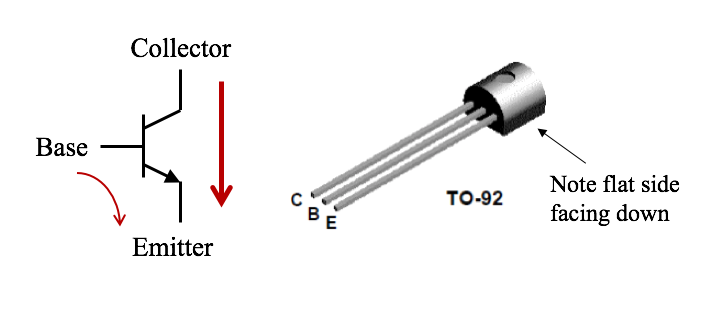

BJTs are current controlled devices. That means that **a small amount of current between the base and 
emitter will control a large amount of current between the collector and emitter**. The current flows
are marked on the transistors by red arrows (see above). (Remember that electrons flow 
opposite of the conventional current designation!) Current flowing between base and emitter causes 
a larger current to flow between collector and emitter.  The direction of flow depends on the type 
of transistor (negative charge must go from N to P), and is controlled by the voltage difference 
between base and emitter.  The voltage of the P region must be around 0.7 V greater than the N 
region.  In our case, we are just interested in the extremes (called "saturation"), where the 
transistor is all the way off (no current anywhere) or all the way on (maximum current flow).  Since
BJTs have very small voltage drops and internal resistance, we will need external resistors to 
ensure that we don't draw too much current and burn the transistor up (jokingly called "letting the 
magic smoke out" due to the nasty smell that is produced when you burn one up).

## Lab Equipment

For this lab, we will be using the blue IDL-800 Digital Lab Trainer.

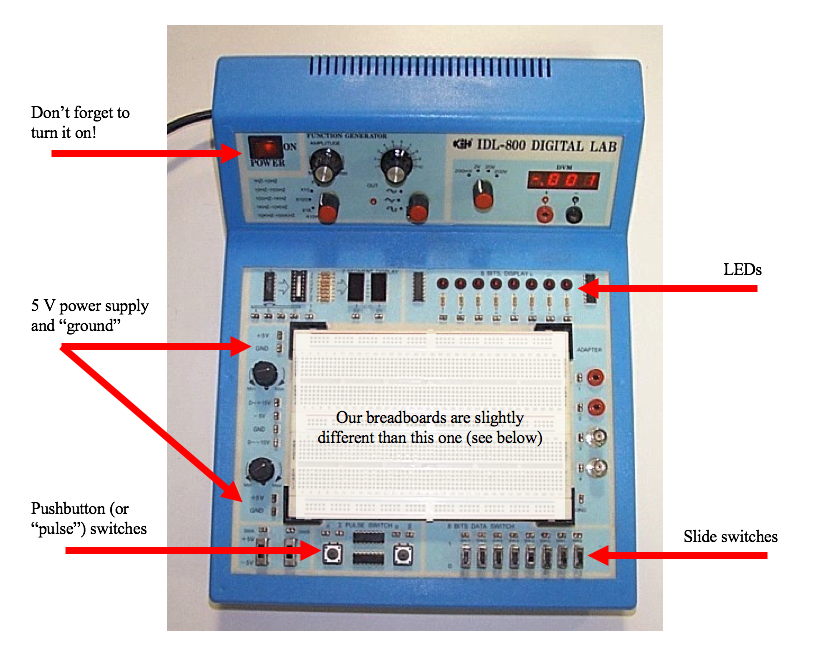

**IDL-800 with breadboard**

This unit has various basic electrical components (including switches and LEDs) that will be useful 
for testing our circuits and a breadboard for constructing circuits (used in the second part of this 
lab).

### Breadboards

Circuits are often tested in the prototype stage by building them on a "breadboard".  

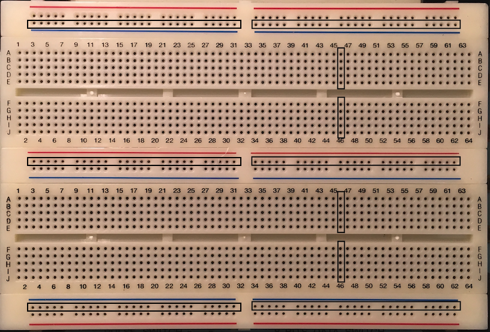

**Breadboard**

One form of a 
breadboard that is often used is a white plastic device with holes arranged in various patterns so 
that certain groups of holes are connected as shown in.  These hole groupings constitute nodes since 
all holes in a group are connected together.  These holes permit insertion of component leads so that 
the necessary connections may be made in the construction of a circuit.  Hole groupings across the 
top and near the bottom of the breadboard form "busses" that may be used for power supply and
ground connections in your circuit.  It should be noted that all of the hole groupings are horizontal 
except for the groupings at the very bottom of the breadboard which are vertical.

In constructing circuits, **do not** insert components with large-diameter leads into the 
breadboard.  An example of such a component is a 1 W resistor.  Also **do not** insert wires with 
twisted or bent ends.  Inserting such components can spread the connectors in the hole and create a 
loose connection when smaller components are subsequently inserted.

### IDL-800 Fixed Components

The components that are permanently attached to the IDL-800 are connected within the unit.  You need 
to understand these connections, so you can use these components correctly.

#### Slide Switches

The slide switches connect their output to either the 5 V power supply or ground (i.e. 1 or 0, as 
labeled on the unit).

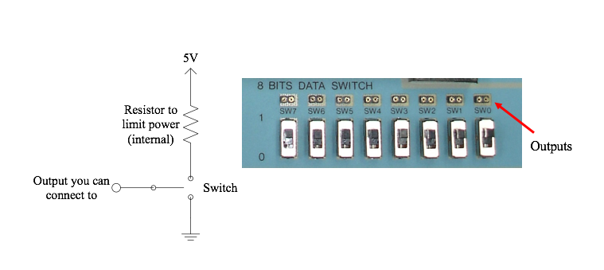

#### LEDs

Similar to the switches, the LEDs are connected through a power limiting resistor to ground.
(It's actually more complicated than this, but this is effectively what is going on.)

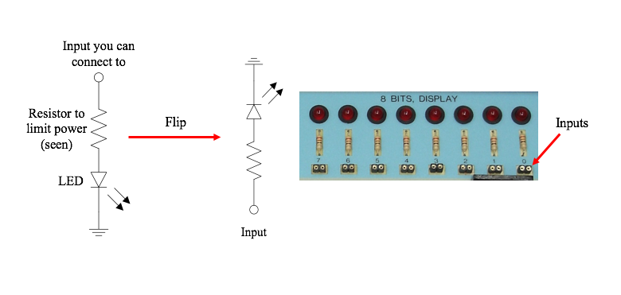

## Materials

You will need:
- four (4) of either the [2N3904](https://www.sparkfun.com/datasheets/Components/2N3904.pdf) or [2N2222](http://www.farnell.com/datasheets/296640.pdf) transistors (don't mix types)
- two (2) pushbuttons
- three (3) resistors around 200-600 &#937;
- breadboard
- wires

## Experiment

### Pushbutton Gates

Just as a test to verify correct operation of the IDL-800, connect one pushbutton between the 5V 
supply bus and one of the LED inputs as shown below.  Pressing the button should make the LED light up.

<!-- 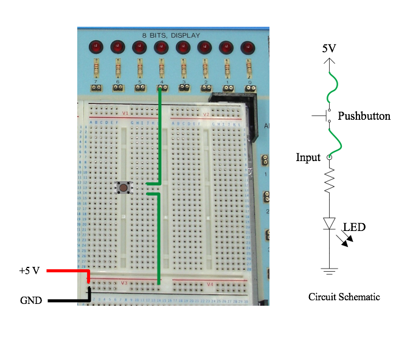 -->
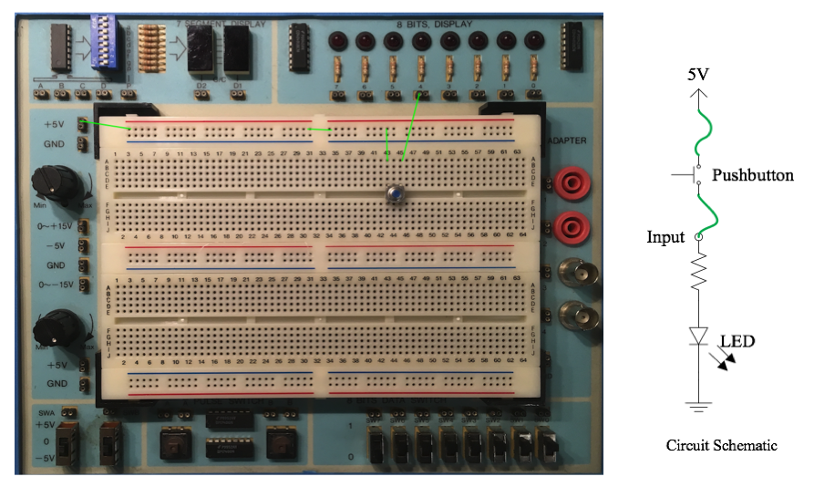

**Remember: Wires and components should insert into the breadboard and input/output terminals on the
IDL-800 with a small amount of force.  Always use clean, straight wires.**

Add a second pushbutton in line (or in "series") with your current wiring as shown below.
This is now an And gate, where the two buttons are acting as the two inputs and the LED displays the
output (5V = 1 = On, Gnd = 0 = Off).

<!-- 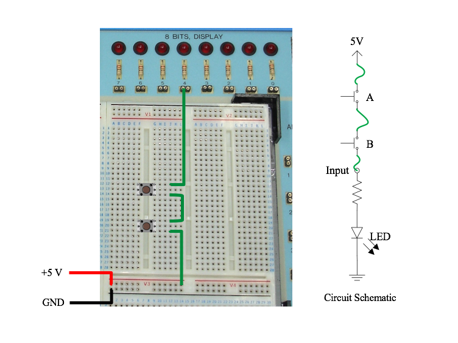 -->
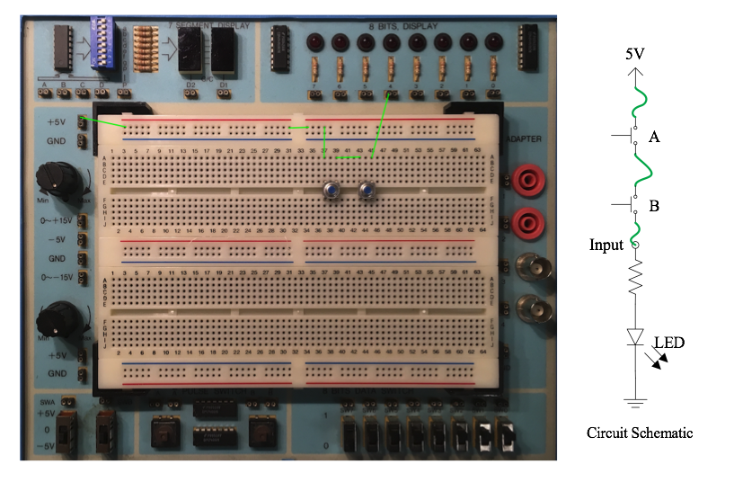

Using the same two pushbuttons, design a circuit that operates like an Or gate.  (Think: How does an
Or gate operate?).

### Inverter

Now we will build an inverter, which is also called a **Not** gate, using an NPN transistor and 
a slide switch as the input.

<!-- 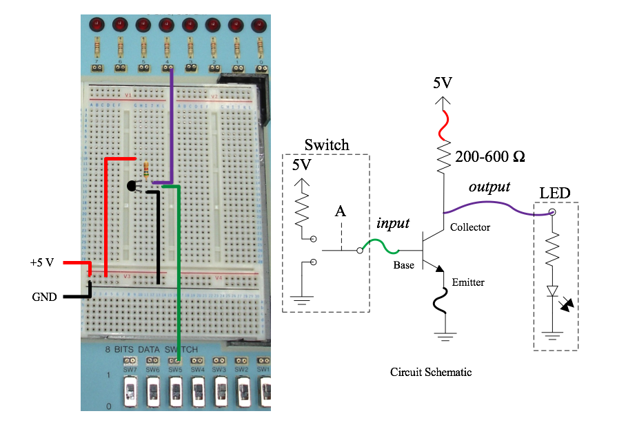 -->
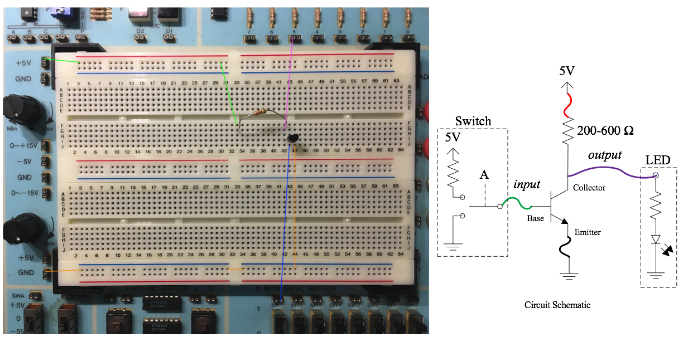

Normally, current-limiting resistors 
are required when building transistor circuits; however, the IDL-800 has resistors built into its 
switches and LEDs.  Thus, we only need one additional resistor on the power supply (between +5 V and 
the collector) of the transistor.  Pay careful attention to the orientation of the transistor and its 
pins (base, emitter, collector).  Note the location of the flat side in \figref{fig:sch_trans_not}.
You may also refer back to [BJT diagram](pics/BJT.png) if needed.  How does this circuit work?  Be prepared to 
discuss your thoughts.  Test its operation and show it to the lab instructor.

### Nor Gate

Now, we will build a **Nor** gate. 

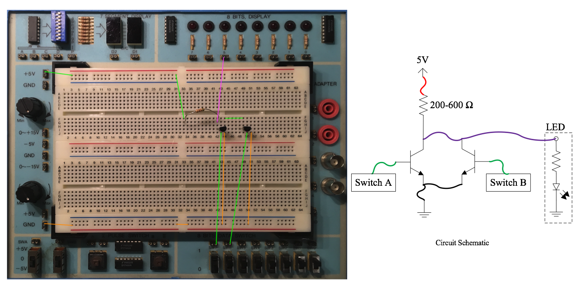

Notice that the transistors 
are in parallel (i.e. connected to the same points on each end).  This is one basic configuration.
Components in series (end-to-end) is the other.  These two basic configurations, parallel and series, 
are used to make almost every gate type, just as you observed with the pushbuttons earlier.  How does 
it work?  Be prepared to discuss your thoughts.  Test its operation and show it to the lab instructor.

## Assignment

See [Assignment](Assignment.md).
